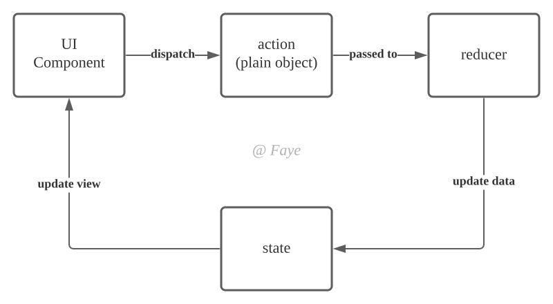
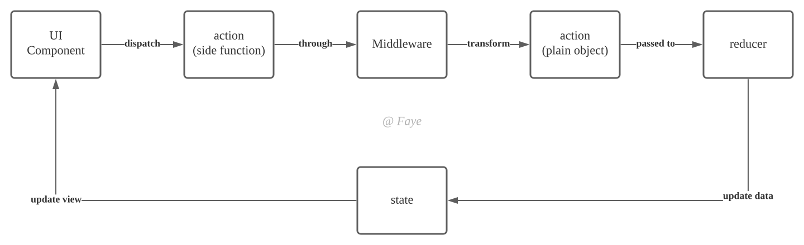

# redux-thunk 源码分析
[redux-thunk 源码](https://github.com/reduxjs/redux-thunk)

### 认识 redux-thunk

#### 为什么需要 redux-thunk？

Redux 遵循函数式编程的规则，`action` 是一个原始 JS 对象（**plain object**）且 `reducer` 是一个**纯函数**，对于同步且没有副作用的操作，起到可以管理数据，从而控制视图层更新的目的。

***但是如果存在副作用，比如ajax异步请求等等，那么应该怎么做？***

如果存在副作用函数，那么我们需要首先处理副作用函数（在 redux 中选择**在发出 `action`，到 `reducer` 处理函数之间**使用中间件处理副作用），然后生成原始的 JS 对象。

在有副作用的 `action` 和原始的 `action` 之间增加中间件处理，<u>**中间件的作用就是**</u>：

<u>转换异步操作，生成原始的 `action`，这样 `reducer` 函数就能处理相应的 `action`，从而改变 `state`，更新 UI。</u>

> 未引入 **redux-thunk**：`store.dispatch(action)` 的 `action` 只能是对象，`dispatch` 只是把 `action` 传给 `reducer`。
> 
> 引入 **redux-thunk**：`store.dispatch(action)` 的 `action` 可以是函数，在 `action` 里可以调接口获取数据，再传给 `store`。

***Redux 的数据流大致如下：***



***Redux 增加 redux-thunk 中间件处理副作用的数据流大致如下：***



### 代码

```
function createThunkMiddleware(extraArgument) {
  return ({ dispatch, getState }) => next => action => {
    if (typeof action === 'function') {
      return action(dispatch, getState, extraArgument);
    }
    return next(action);
  };
}

const thunk = createThunkMiddleware();
thunk.withExtraArgument = createThunkMiddleware;

export default thunk;
```